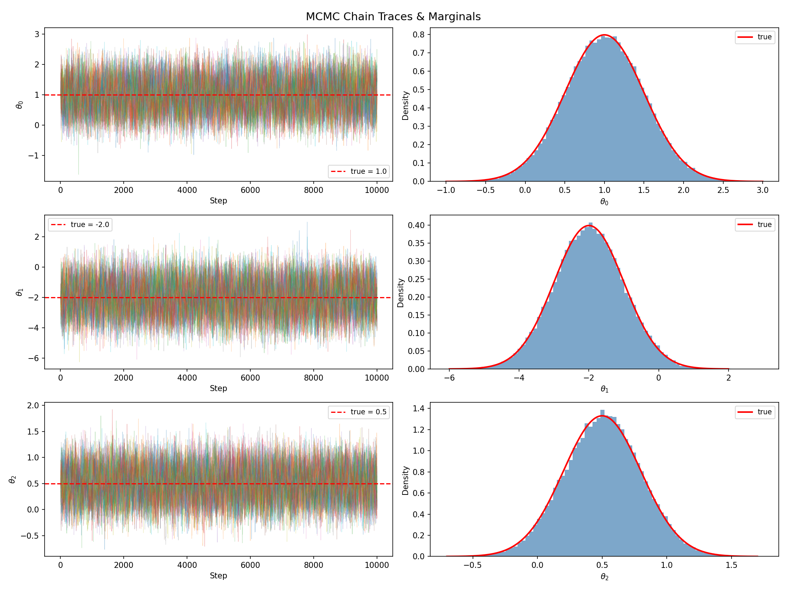

# emcee-cpp

A header-only C++ implementation of the **emcee** affine-invariant ensemble sampler.

[](https://en.wikipedia.org/wiki/C%2B%2B17)
[](https://opensource.org/licenses/MIT)

`emcee-cpp` is a lightweight, zero-dependency C++ port of the popular Python [emcee](https://github.com/dfm/emcee) package. It implements the Goodman & Weare (2010) affine-invariant MCMC ensemble sampler, providing a robust and efficient way to sample from complex posterior distributions.


## Key Features

- **Header-only:** Easy integration into any project—just include the headers.
- **Zero Dependencies:** Requires only the C++17 standard library.
- **Affine-Invariant:** Uses the "Stretch Move" by default, which performs well even with highly anisotropic distributions.
- **Multiple Moves:** Includes Stretch, Differential Evolution (DE), and Gaussian moves.
- **Multi-threaded:** Parallel evaluation of walker log-probabilities using a built-in thread pool.
- **Analysis Tools:** Integrated estimation of autocorrelation time.
- **Serialization:** Save chains to CSV or binary formats.

## Installation

Since `emcee-cpp` is header-only, you can simply copy the `include/emcee` directory to your project's include path.

If you use CMake:

```cmake
# Add the include directory
include_directories(${CMAKE_CURRENT_SOURCE_DIR}/emcee-cpp/include)

# Or as an interface library
add_library(emcee INTERFACE)
target_include_directories(emcee INTERFACE ${CMAKE_CURRENT_SOURCE_DIR}/emcee-cpp/include)
```

## Quick Start

```cpp
#include "emcee/emcee.hpp"
#include <vector>
#include <cmath>

// 1. Define your log-probability function
double log_prob(const double* x, int ndim) {
    // Example: Standard Normal N(0, 1)
    double lp = 0;
    for (int i = 0; i < ndim; ++i) lp -= 0.5 * x[i] * x[i];
    return lp;
}

int main() {
    int ndim = 2;
    int nwalkers = 16;
    int nsteps = 1000;

    // 2. Initialize the sampler
    emcee::EnsembleSampler sampler(nwalkers, ndim, log_prob);

    // 3. Initialize walkers
    std::vector<std::vector<double>> init(nwalkers, std::vector<double>(ndim));
    // ... fill init with starting positions ...

    // 4. Run MCMC
    sampler.run_mcmc(init, nsteps);

    // 5. Get results
    auto chain = sampler.get_chain(); // [nsteps][nwalkers][ndim]
    return 0;
}
```

## Building the Example

The project includes a multi-dimensional Gaussian test example.

```bash
mkdir build && cd build
cmake ..
make
./gaussian
```

After running the example, you can use the provided Python script to animate the chain:

```bash
python3 ../examples/animate_chain.py
```

## Visualizations

### Chain Trails


### Trace Plots


## License

This project is licensed under the MIT License - see the [LICENSE](LICENSE) file for details (or standard MIT terms).

## References

- Goodman & Weare (2010), *Ensemble Samplers with Affine Invariance*, Comm. App. Math. Comp. Sci., 5, 65.
- Foreman-Mackey et al. (2013), *emcee: The MCMC Hammer*, PASP, 125, 306.

## AI Tools Used

* claude
* gemini
* mimo-v2.5-pro
